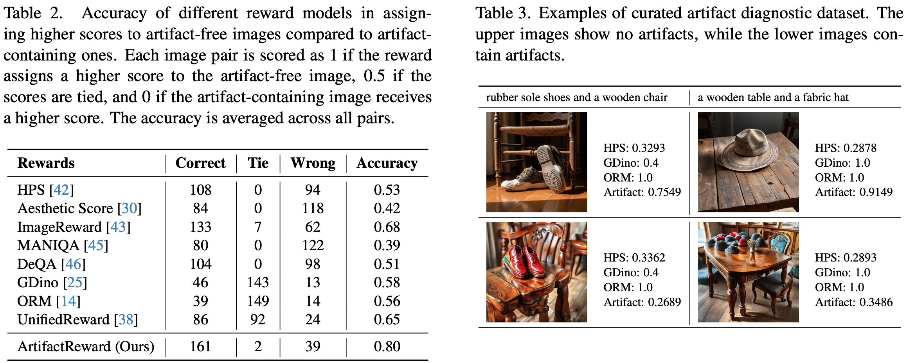
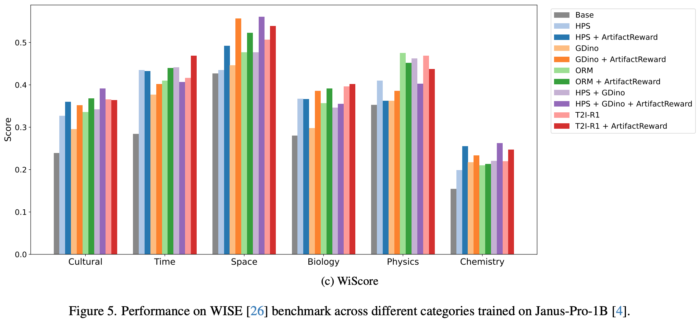

# 🔥 Understanding Reward Hacking in Text-to-Image Reinforcement Learning

🙌 Official repository for paper "[Understanding Reward Hacking in Text-to-Image Reinforcement Learning](https://arxiv.org/abs/2601.03468)".

Authors: [Yunqi Hong](https://yq-hong.github.io/),  [Kuei-Chun Kao](https://johnsonkao0213.github.io/), [Hengguang Zhou](https://hengguangzhou.github.io/), [Cho-Jui Hsieh](https://web.cs.ucla.edu/~chohsieh/)

## 👀 Overview
Reinforcement learning for text-to-image generation relies heavily on learned reward models and automated evaluation metrics. Despite strong apparent performance, these rewards are often **exploitable**, leading to reward hacking behaviors such as structural corruption and visually implausible artifacts.

This repository provides a **unified framework for analyzing reward hacking in text-to-image RL**, including implementations of widely used reward models and evaluation metrics, as well as tools for studying their failure modes under RL optimization. All rewards are exposed through a common interface, enabling easy swapping, combination, and joint optimization during RL training.

### 🏆 Implemented Rewards & Evaluation Metrics
- Human preference rewards: [HPS](https://arxiv.org/pdf/2306.09341), [PickScore](https://arxiv.org/pdf/2305.01569), [ImageReward](https://arxiv.org/pdf/2304.05977)
- Image Quality Assessment: [Aesthetic](https://arxiv.org/PDF/2210.08402), [MANIQA](https://arxiv.org/pdf/2204.08958), [DeQA](https://arxiv.org/pdf/2501.11561)
- Text-Image Alighment: [GroundingDINO](https://arxiv.org/pdf/2303.05499), [ORM](https://arxiv.org/pdf/2501.13926), [VQAScore](https://arxiv.org/pdf/2404.01291)
- LLM-as-a-Judge: [UnifiedReward](https://arxiv.org/pdf/2503.05236)
These implementations enable controlled comparisons and systematic analysis of reward behaviors in isolation or in combination.

### 🌟 ArtifactReward
To make reward hacking more observable and measurable, we introduce **ArtifactReward**, a structure-aware reward that explicitly targets common visual artifacts consistently missed by existing rewards.
Rather than replacing existing rewards, ArtifactReward is intended as a **diagnostic and complementary signal** that exposes shared structural blind spots across existing text-to-image rewards.
In practice, ArtifactReward can be linearly combined with existing reward models, acting as a **lightweight regularizer** that discourages artifact-heavy generations while preserving the strengths of established rewards during RL training.

<div align="center">

</div>

## 💪 Get Started

### Installation

Clone the repository:
   ```bash
   git clone https://github.com/yq-hong/ArtifactReward.git
   cd ArtifactReward
   ```

Create a conda environment for T2I RL training:
   ```bash
   conda create -n artifactrewards python=3.10
   conda activate artifactrewards
   ```

Install additional dependencies:
   ```bash
   cd src
   pip install -r requirements.txt
   ```
   Note that other newer versions of torch, transformers, and trl may also work.

### Set up for Reward Models

- LLaVA-Next for **ORM** reward:
   ```bash
   cd src/t2i-r1/src/utils/LLaVA-NeXT
   pip install -e ".[train]"
   ```
   - Download ORM checkpoint from [this link](https://huggingface.co/CaraJ/ORM-T2I-R1) by
   ```bash
   huggingface-cli download CaraJ/ORM-T2I-R1 --repo-type model --local-dir ORM-T2I-R1
   ```
- **GrouningDINO** for Object Detector reward:
   ```bash
   cd src/t2i-r1/src/utils/GroundingDINO
   pip install -e .
   ```
   - Download GroundingDINO from [this link](https://github.com/IDEA-Research/GroundingDINO/releases/download/v0.1.0-alpha/groundingdino_swint_ogc.pth) by
   ```bash
   wget https://github.com/IDEA-Research/GroundingDINO/releases/download/v0.1.0-alpha/groundingdino_swint_ogc.pth
   ```
- **HPSv2** for Human Preference reward:
   ```bash
   git clone https://github.com/tgxs002/HPSv2.git
   cd HPSv2
   pip install -e .
   ```
   - Download HPS checkpoint from [this link](https://huggingface.co/xswu/HPSv2/resolve/main/HPS_v2.1_compressed.pt) by
   ```bash
   wget https://huggingface.co/xswu/HPSv2/resolve/main/HPS_v2.1_compressed.pt
   ```

### Set up for ArtifactReward

Create a conda environment for vLLM serving:
   ```bash
   conda create -n vllm python=3.10
   conda activate vllm
   ```

Install additional dependencies:
   ```bash
   pip install torch==2.7.0
   pip install --no-deps vllm==0.9.0.1
   pip install transformers==4.52.4
   ```

Download [Qwen2.5-VL-7B-Instruct](https://github.com/QwenLM/Qwen2.5-VL) with [this link](https://huggingface.co/Qwen/Qwen2.5-VL-7B-Instruct):
   ```bash
   huggingface-cli download Qwen/Qwen2.5-VL-7B-Instruct --repo-type model --local-dir Qwen2.5-VL-7B-Instruct
   ```

Serve the model:
   ```bash
   cd src
   bash scripts/serve_qwen.sh
   ```

### Set up for Other Evaluation Metrics

- **Aesthetic** score
   - Download aesthetic-predictor checkpoint from [this link](https://github.com/LAION-AI/aesthetic-predictor):
   ```bash
   git clone https://github.com/LAION-AI/aesthetic-predictor.git
   ```
- **MANIQA** for Image Quality Assessment
   ```bash
   cd src/t2i-r1/src/utils
   git clone https://github.com/IIGROUP/MANIQA.git
   ```
   - Download [MANIQA](https://github.com/IIGROUP/MANIQA) checkpoint from [this link](https://github.com/IIGROUP/MANIQA):
   ```bash
   wget https://github.com/IIGROUP/MANIQA/releases/download/Koniq10k/ckpt_koniq10k.pt
   ```
- **PickScore** for Human Preference Assessment
   - Download [PickScore](https://github.com/yuvalkirstain/PickScore) checkpoint from [this link](https://huggingface.co/yuvalkirstain/PickScore_v1):
   ```bash
   huggingface-cli download yuvalkirstain/PickScore_v1 --repo-type model --local-dir PickScore_v1
   ```
- **VQAScore** for Text-Image Alignment
   ```bash
   cd src/t2i-r1/src/utils
   git clone https://github.com/linzhiqiu/t2v_metrics.git
   ```
   - Download [clip-flant5-xxl](https://github.com/linzhiqiu/t2v_metrics/tree/main) checkpoint from [this link](https://huggingface.co/zhiqiulin/clip-flant5-xxl) for VQAScore:
   ```bash
   huggingface-cli download zhiqiulin/clip-flant5-xxl --repo-type model --local-dir clip-flant5-xxl
   ```
- **ImageReward** for Human Preference Assessment
   ```bash
   git clone https://github.com/zai-org/ImageReward.git
   cd ImageReward
   pip install image-reward
   pip install git+https://github.com/openai/CLIP.git
   ```
- **DeQA** for Image Quality Assessment (environment in `deqa`)
   ```bash
   conda create -n deqa python=3.10
   conda activate deqa
   pip install torch==2.5.1
   pip install transformers==4.36.1
   ```
   - Download [DeQA-Score](https://github.com/zhiyuanyou/DeQA-Score/) checkpoint from [this link](https://huggingface.co/zhiyuanyou/DeQA-Score-Mix3):
   ```bash
   huggingface-cli download zhiyuanyou/DeQA-Score-Mix3 --repo-type model --local-dir DeQA-Score-Mix3
   ```
- **UnifiedReward**
   ```bash
   conda create -n unifiedreward python=3.10
   conda activate unifiedreward
   git clone https://github.com/CodeGoat24/UnifiedReward.git
   cd UnifiedReward
   pip install -e ".[train]"
   ```
   - Download [UnifiedReward](https://github.com/CodeGoat24/UnifiedReward) checkpoint from [this link](https://huggingface.co/CodeGoat24/UnifiedReward-7b-v1.5) or [this link](https://huggingface.co/CodeGoat24/UnifiedReward-qwen-7b):
   ```bash
   huggingface-cli download CodeGoat24/UnifiedReward-7b-v1.5 --repo-type model --local-dir UnifiedReward-7b-v1.5
   huggingface-cli download CodeGoat24/UnifiedReward-qwen-7b --repo-type model --local-dir UnifiedReward-qwen-7b
   ```
   - Serve the model using vLLM:
   ```bash
   cd src
   bash scripts/serve_unified.sh
   ```

## ✨ ArtifactReward
```bash
cd src/t2i-r1/src/apo
```

### Automatic Prompt Optimization
```bash
python main.py --model Qwen2.5-VL-7B-Instruct --gradient_model Qwen2.5-VL-7B-Instruct --data_folder {your_data_folder} --result_folder {your_result_folder} --exp 0
```

### ArtifactReward Evaluation
```bash
python classification.py --model Qwen2.5-VL-7B-Instruct --exp 0 --prompt_idx 0 --data_folder {your_data_folder} --out 1
```

## 🚀 Training
```bash
cd src
bash scripts/run_grpo.sh
```

Notes:
+ Parameters:
   - reward_funcs: The options are `hps`, `gdino`, `orm`, `artifacts`. You can choose whatever composition you need for training. Make sure to substitute the correct checkpoint path and config path in the `run_grpo.sh`

## 💫 Image Generation and Evaluation
```bash
cd src/t2i-r1/src/infer
```

### Image Generation
```bash
python generate_inference.py --data_path {your_data_path} --model_path {your_model_path} --image_dir {your_save_dir}
```

### Reward Calculation
```bash
python collect_eval.py --eval_type {choose_reward} --data_path {your_data_path} --image_dir {your_image_dir} --output_dir {your_output_dir} --generate_number 1
python gdino_eval.py --data_path {your_data_path} --image_dir {your_image_dir} --output_dir {your_output_dir} --generate_number 1
python unified_eval.py --mode vllm --data_path {your_data_path} --image_dir {your_image_dir} --output_dir {your_output_dir} --generate_number 1
```

### Benchmark Evaluation
[WISE](https://github.com/PKU-YuanGroup/WISE) benchmark:
```bash
python gpt_eval.py --data_path {your_data_path} --image_dir {your_image_dir} --output_dir {your_output_dir} --generate_number 1
```

<div align="center">

</div>

## 🎊 Acknowledgements
We would like to thank [T2I-R1](https://github.com/CaraJ7/T2I-R1), upon which our repo is built.

## ⭐ Cite
```
@article{hong2026understanding,
  title={Understanding Reward Hacking in Text-to-Image Reinforcement Learning},
  author={Hong, Yunqi and Kao, Kuei-Chun and Zhou, Hengguang and Hsieh, Cho-Jui},
  journal={arXiv preprint arXiv:2601.03468},
  year={2026}
}
```